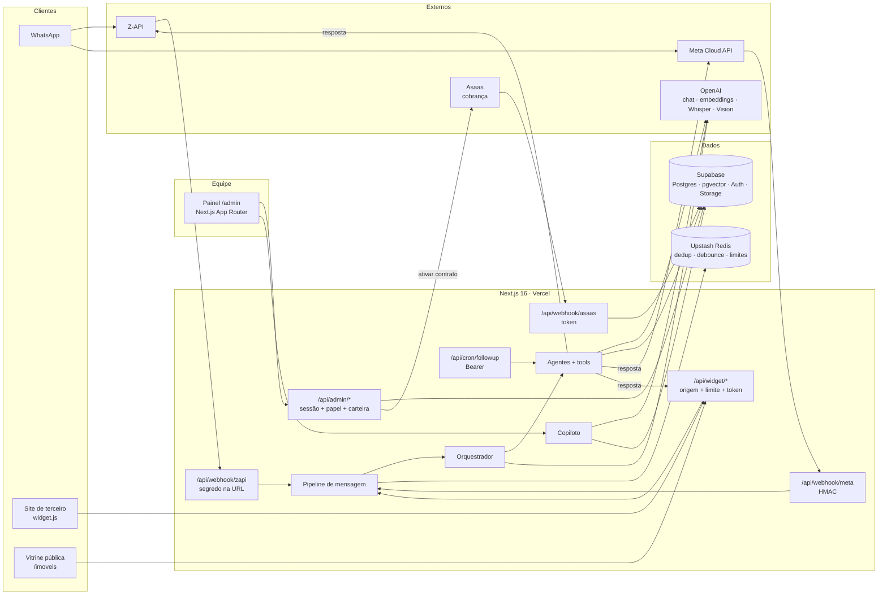
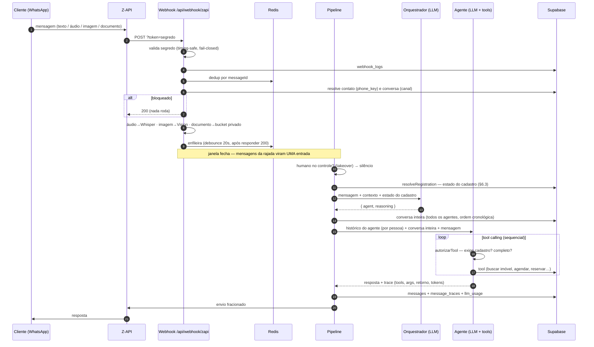
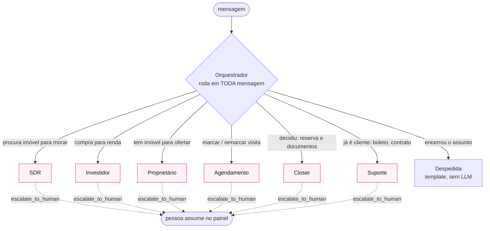
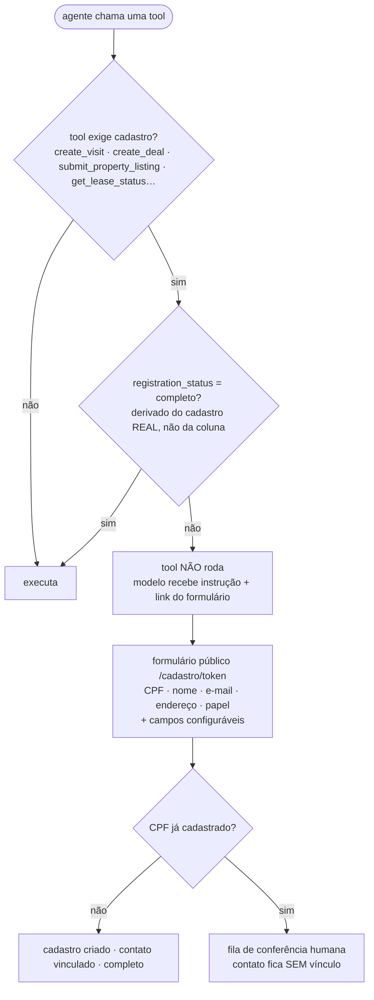
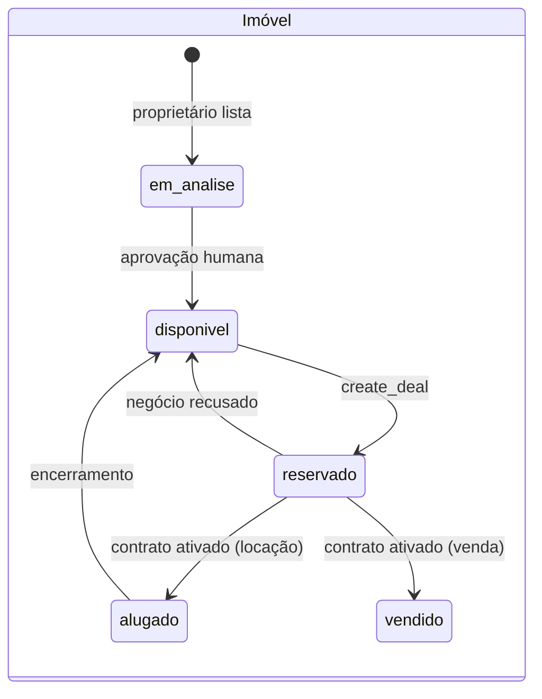
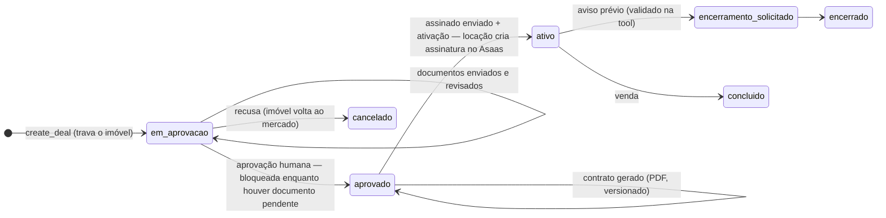
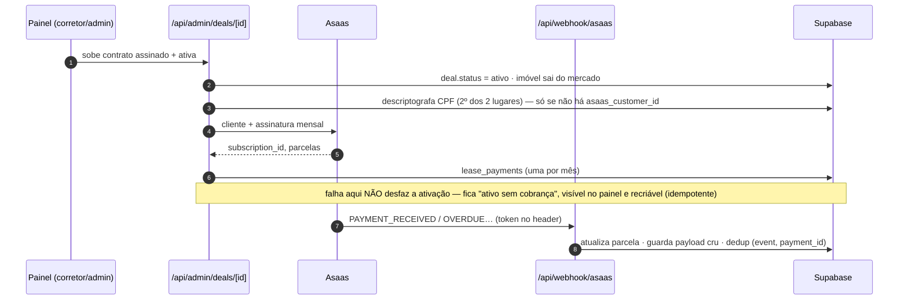
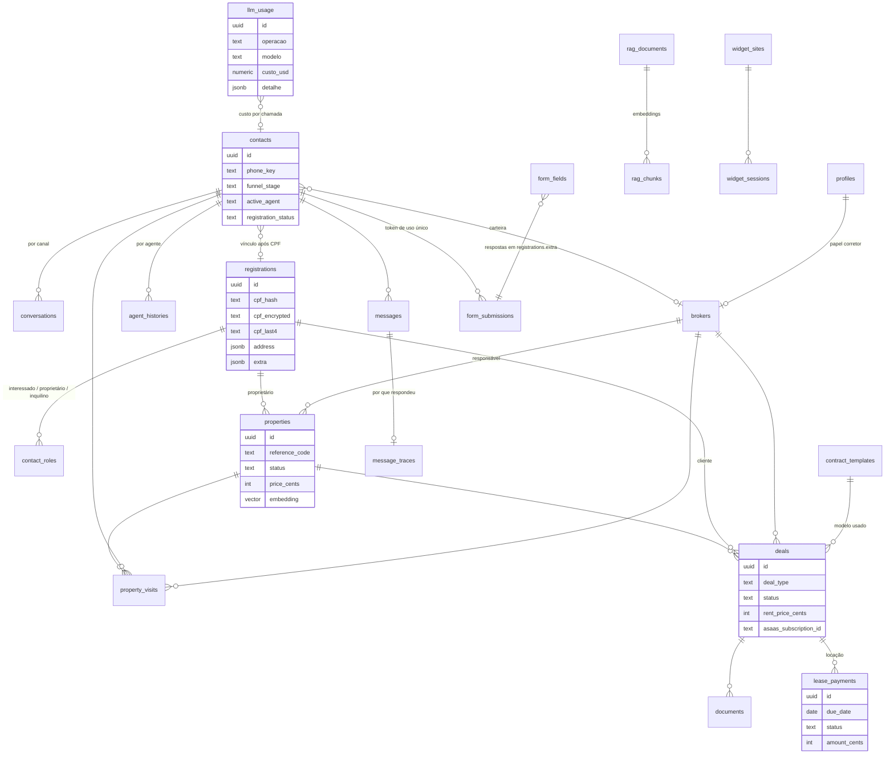
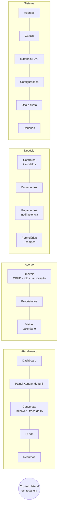
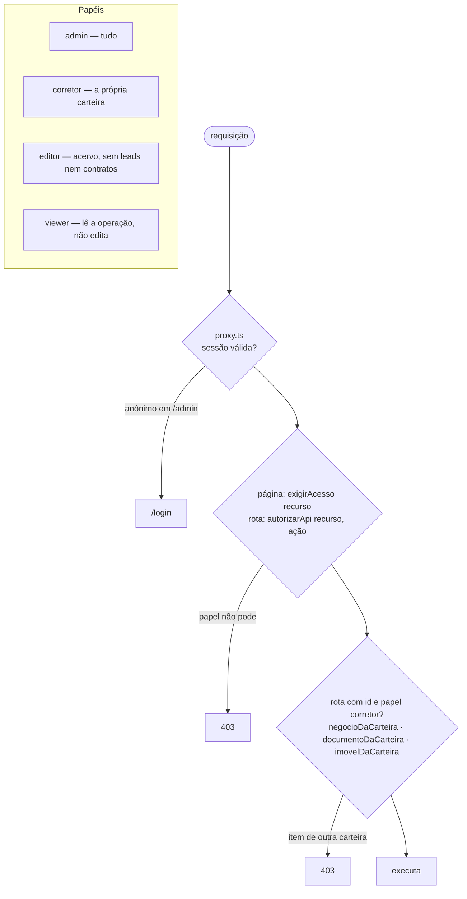

# LoveHome — Atendimento e gestão imobiliária com IA

Plataforma de **atendimento e gestão imobiliária via WhatsApp + web**, com agentes de IA especializados que qualificam leads, agendam visitas, cadastram imóveis de proprietários, conduzem reserva e documentação, geram contrato e dão suporte a inquilinos — e um painel de operação para a equipe da imobiliária.

Nasceu como resposta ao **Tech Challenge FIAP — Fase 5** (*Agente SDR Imobiliário com Inteligência Artificial*), tratado como o primeiro marco de um produto completo: o SDR que qualifica e agenda é a porta de entrada de um ciclo que vai até o contrato assinado e a cobrança mensal.

---

## Sumário

1. [Objetivo](#1-objetivo)
2. [O que o sistema faz](#2-o-que-o-sistema-faz)
3. [Arquitetura](#3-arquitetura)
4. [Como uma mensagem vira resposta](#4-como-uma-mensagem-vira-resposta)
5. [Agentes e roteamento](#5-agentes-e-roteamento)
6. [Identidade e o portão de cadastro](#6-identidade-e-o-portão-de-cadastro)
7. [Ciclo do negócio: da reserva à cobrança](#7-ciclo-do-negócio-da-reserva-à-cobrança)
8. [Modelo de dados](#8-modelo-de-dados)
9. [Painel de operação](#9-painel-de-operação)
10. [Segurança e autorização](#10-segurança-e-autorização)
11. [Observabilidade e custo](#11-observabilidade-e-custo)
12. [Stack e decisões técnicas](#12-stack-e-decisões-técnicas)
13. [Como rodar](#13-como-rodar)
14. [Verificação (`check:*`)](#14-verificação-check)
15. [Deploy](#15-deploy)
16. [Roteiro](#16-roteiro)

---

## 1. Objetivo

Uma imobiliária recebe dezenas de contatos por dia pelo WhatsApp e pelo site — gente procurando imóvel, investidor pesquisando renda, proprietário querendo anunciar, inquilino perguntando do boleto. Hoje isso cai numa fila humana que responde tarde, esquece de fazer follow-up e não registra nada.

O LoveHome coloca **agentes de IA na primeira linha** desse atendimento e entrega à equipe um **painel de operação** com tudo o que a IA fez, por que fez, e o que precisa de decisão humana. As regras de negócio que têm consequência — quem pode agendar visita, quem pode ver contrato, quando um imóvel sai do mercado — **não dependem de o modelo lembrar**: são aplicadas em código, antes ou depois do modelo, nunca por prompt.

---

## 2. O que o sistema faz

| Área | Funcionalidades |
|---|---|
| **Atendimento (IA)** | 7 agentes especializados roteados por um Orquestrador a cada mensagem · busca híbrida de imóveis (filtro + reranking semântico) · agendamento de visita com agenda real do corretor · cadastro formal por CPF via formulário seguro · listagem de imóvel pelo proprietário com aprovação humana · reserva, coleta e revisão de documentos · suporte a inquilino (boleto, contrato, aviso de saída) com confirmação de titularidade · follow-up automático · transcrição de áudio e análise de imagem · base de conhecimento institucional (RAG) |
| **Canais** | WhatsApp via Z-API · WhatsApp Cloud API (Meta) · widget web embutível em qualquer site · vitrine pública de imóveis · memória do agente **por pessoa**, unificada entre canais |
| **Ciclo do negócio** | reserva trava o imóvel · aprovação humana · contrato gerado em PDF a partir de modelos editáveis · assinatura manual/gov.br · ativação tira o imóvel do mercado · cobrança recorrente no Asaas · conciliação por webhook |
| **Painel** | Dashboard · funil Kanban · conversas com takeover humano e trace da IA · leads e resumos · imóveis (CRUD, fotos, aprovação) · proprietários · visitas (calendário) · contratos e modelos · documentos · pagamentos e inadimplência · formulários e campos configuráveis · corretores e usuários · agentes (prompt/modelo/temperatura) · canais · materiais (RAG) · configurações · uso e custo de IA |
| **Copiloto interno** | assistente lateral em todo o painel — responde sobre carteira, funil, agenda, inadimplência, contratos e políticas da empresa, **com as ferramentas filtradas pelo perfil de quem pergunta** |

---

## 3. Arquitetura



Três decisões estruturais sustentam esse desenho:

- **Toda leitura do servidor passa pelo `service_role` do Supabase**; a autorização mora na aplicação (`exigirAcesso` em cada página, `autorizarApi` em cada rota, recorte por carteira nas rotas com id). O RLS existe como defesa em profundidade caso a chave anon vaze — nenhuma tabela tem policy para `anon`.
- **Regra com consequência não vive no prompt.** Portão de cadastro, confirmação de CPF, escopo por corretor, quais ferramentas o Copiloto oferece — tudo é aplicado em código, na execução da tool ou na montagem da lista de tools.
- **Um ponto único para cada preocupação transversal**: cifra de credenciais, parâmetros por modelo, registro de custo, recorte por carteira, catálogo de placeholders de contrato. Se aparecer um segundo lugar fazendo a mesma coisa, é bug.

---

## 4. Como uma mensagem vira resposta



Pontos que valem destaque:

- **O webhook responde 200 antes de processar** — a espera do debounce roda em `after()`, e o Z-API não reentrega por timeout.
- **A mensagem é gravada antes de ser enviada.** Se o canal falhar, o histórico mostra que houve tentativa — que é exatamente quando alguém precisa saber.
- **Tools rodam em sequência**, não em paralelo: o agente Proprietário chama `save_property_draft` e `submit_property_listing` na mesma rodada, e as duas mexem no mesmo rascunho.

---

## 5. Agentes e roteamento



- **Os agentes não se repassam entre si.** Quem troca é o Orquestrador, em código, a cada mensagem — repasse por tool dependeria de o modelo lembrar de chamá-la. Quem falava com o SDR e pergunta do boleto cai no Suporte na mensagem seguinte.
- **Memória por pessoa, não por canal**: `agent_histories` é chaveada por `(contact_id, agent)`. Quem começa no site e continua no WhatsApp encontra o mesmo agente lembrando da conversa.
- **Duas memórias, uma completa e uma de trabalho.** Cada agente carrega o próprio `agent_histories` como mensagens de chat, e **todo** agente recebe no prompt a conversa inteira lida de `messages` — cliente, cada agente, corretor humano, follow-up — em ordem cronológica e rotulada (`lib/pipeline/contexto-conversa.ts`). Sem a segunda, a troca de agente perdia o fio: o SDR mostrava o imóvel, a pessoa perguntava "que dia posso visitar?" e o Agendamento, com histórico próprio vazio, perguntava "qual imóvel?". Vai como transcrição e não como mensagens `assistant` para o modelo não assumir a autoria do que outro agente escreveu. Link que a equipe já enviou nessa conversa passa a ser fonte confiável no filtro de link inventado, e o link de cadastro não é reenviado por agente novo.
- **Hora é sempre de São Paulo, nunca do servidor.** A Vercel roda em UTC; a agenda do corretor ("09:00–18:00") e o que a pessoa fala ("quinta às 10h") são relógio de SP. Toda conversão passa por `lib/agenda/fuso.ts` — inclusive "hoje" do Copiloto, início do dia nas telas de pagamentos e uso, aviso prévio no Suporte, data do contrato e os formatadores `data()`/`dataHora()` de `lib/utils/format.ts` (saem em SP no servidor e no navegador) — e a decisão "este horário está livre?" é UMA função (`lib/agenda/slots.ts`) usada tanto por `check_broker_availability` quanto por `create_visit`. `check_broker_availability` devolve cada horário como `{quando: '2026-08-20T10:00:00-03:00', descricao: 'quinta-feira 20/08 às 10h'}` e o modelo repassa `quando` intacto; `create_visit` recheca janela, bloqueio e conflito, e quando recusa já devolve alternativas na mesma resposta. Antes eram dois cálculos (consulta em UTC, confirmação em -03:00) e o agente entrava em loop: "está livre" → "acabou de ser ocupado" → "está livre". Todo agente recebe também uma linha `AGORA: segunda-feira, 17/08/2026, 16:36` no prompt.
- **Cancelar e remarcar passam pela mesma regra que marcar** (`lib/agenda/visitas.ts`, usada pelo agente e pelo painel). O Agendamento tem `list_my_visits`, `cancel_visit` e `reschedule_visit`: cancelar muda o status (o índice parcial libera a janela na hora — não existe passo "liberar"); remarcar **move a mesma visita** para um horário livre da equipe elegível (o corretor pode mudar e o cliente é avisado), e se o novo horário não serve a visita antiga continua valendo. No painel, cada visita tem ações — confirmar, reagendar, cancelar (com motivo), realizada, não compareceu — com "avisar o cliente pelo canal dele" marcado por padrão; o aviso é gravado em `messages` como `agent: 'sistema'`, então os agentes sabem que a visita mudou. Corretor só mexe nas visitas dele.
- **Quem atende a visita é decidido na confirmação, não pelo imóvel.** A equipe elegível é o corretor responsável mais quem tem o bairro nas **áreas de atuação** (`brokers.region_focus`; `lib/agenda/equipe.ts`). Os horários oferecidos são a **união** das agendas — vários corretores livres no mesmo horário é o normal — e `create_visit` escolhe um: o responsável se estiver livre; senão quem tem menos visitas no dia. A resposta da tool devolve nome, telefone e e-mail, e o agente informa ao cliente com quem será a visita. Janela é de 1h na hora cheia, com almoço fora (`break_start/break_end`); choque de horário é impossível por construção — mesmo critério de "livre" na consulta e na confirmação, e índices únicos parciais em `property_visits` para visitas ativas, por `(broker_id, scheduled_at)` **e por `(property_id, scheduled_at)`** (migration 035): nem o mesmo corretor em dois lugares, nem duas pessoas no mesmo imóvel com corretores diferentes — e duas confirmações simultâneas não gravam as duas.
- **A única saída que o agente controla é `escalate_to_human`** — marca a conversa como escalada e devolve o assunto para uma pessoa.
- Cada agente tem prompt, modelo e temperatura editáveis no painel; a lista de modelos é fechada e cada um carrega suas capacidades reais de payload (gpt-5 e os de raciocínio recusam `temperature` e `max_tokens` — a tela desabilita o que o modelo não aceita).

**Ferramentas por agente (resumo):**

| Agente | Tools |
|---|---|
| SDR | `search_properties` (filtro + reranking semântico), `save_qualification`, `search_knowledge_base`, `request_registration_form` |
| Investidor | `search_properties`, `save_qualification` |
| Proprietário | `save_property_draft`, `submit_property_listing` (nasce `em_analise`, vai para aprovação), `get_market_comparables`, `search_knowledge_base`, `request_registration_form` |
| Agendamento | `check_broker_availability`, `create_visit` (exige cadastro completo), `search_properties`, `request_registration_form` |
| Closer | `create_deal` (reserva e trava o imóvel), `request_documents`, `confirm_document_received`, `search_properties`, `search_knowledge_base`, `request_registration_form` |
| Suporte | `confirmar_titularidade` (CPF por hash, válido 12h) → `get_lease_status`, `get_payment_statement`, `request_lease_termination`; `search_knowledge_base` |
| Todos | `escalate_to_human` |

---

## 6. Identidade e o portão de cadastro

Duas camadas de identidade que **nunca se fundem**:

| Camada | Tabela | Chave | Regra |
|---|---|---|---|
| Conversacional | `contacts` | `phone_key` (últimos 8 dígitos) | Recall > precisão: nunca perder o fio da conversa |
| Formal | `registrations` | CPF | Precisão total: sustenta contrato, cobrança e propriedade |

CPF são **três colunas com papéis distintos**: `cpf_hash` (HMAC, indexável — a chave de busca), `cpf_encrypted` (AES-256-GCM, reversível só no servidor) e `cpf_last4` (exibição). Ele é descriptografado em **exatamente dois lugares**: gerar contrato e criar o cliente no Asaas — e o segundo acontece uma vez na vida do cadastro.



- Conversar e buscar imóvel **não** exigem cadastro — pedir CPF antes da busca mataria o problema que o produto resolve. O portão é **por tool**, aplicado no laço de tool calling, não por agente e não por prompt.
- **CPF já cadastrado nunca vincula sozinho.** CPF de terceiro é fácil de obter; auto-vincular deixaria alguém consultar contrato e boleto de outra pessoa. Vai para conferência humana, e vincular exige perfil de administrador.
- Os campos configuráveis do formulário **nunca participam do portão**: uma pergunta obrigatória nova barra quem preencher a partir de agora e não rebaixa ninguém que já se cadastrou.

---

## 7. Ciclo do negócio: da reserva à cobrança







- **Aprovar trava enquanto houver documento em revisão** — a sequência é revisar e só então aprovar. Zero documento apenas avisa: aí é decisão de quem revisa.
- **Gerar contrato exige negócio aprovado e não sobrescreve** a versão anterior (pode já ter sido enviada ao cliente). O modelo vem de `contract_templates`, editável no painel; placeholder fora do catálogo é **recusado**, porque sairia literal no PDF assinado.
- **"Vencida" é calculado** comparando a data com hoje, não lido da coluna — o status só vira `atrasado` quando o webhook chega, e antes do deploy nenhum webhook chega.

---

## 8. Modelo de dados



Convenções: vocabulário de domínio em português (`em_analise`, `qualificado`), identificadores técnicos em inglês, **valores monetários sempre em centavos**, RLS habilitado em toda tabela `public`, `pgvector` para busca semântica de imóveis e RAG. 34 migrations versionadas em `supabase/migrations/`.

---

## 9. Painel de operação



- **Conversas**: a faixa de estado diz quem está no controle (IA ou pessoa); ninguém responde sem assumir — porque a resposta humana não entra no contexto do modelo, e os dois se contradiriam na frente do cliente. Embaixo de cada resposta da IA, o **trace**: qual agente, por quê, quais tools com argumentos e retorno, prompt e resposta crua.
- **Kanban**: funil de leads, sem trava de transição (o corretor sabe coisas que a conversa não contém); recorte por carteira checado ao ler e ao mover.
- **Visitas**: calendário, lista e **por imóvel** — ocupação de cada apartamento (quem vai, quando, com qual corretor), com marca de conflito se houver duas visitas ativas a menos de 1h no mesmo imóvel (dado legado; o motor não cria mais assim). Filtro por corretor e por imóvel. A ficha do imóvel também mostra a agenda dele.
- **Corretores**: ficha editável — contato, especialidade, áreas de atuação (bairros, com sugestão do acervo) e agenda semanal com início/fim e almoço por dia. Admin edita todos; o próprio corretor edita a própria ficha (menos ativar/desativar). É daqui que o agente de agendamento tira horário e a quem entrega a visita.
- **Copiloto**: quais ferramentas existem sai da matriz de papéis, no servidor — um editor não recebe a tool de inadimplência porque ela nem entra na lista enviada ao modelo. O recorte por corretor é ligado por closure; nenhum schema de tool aceita `broker_id`.

---

## 10. Segurança e autorização



| Superfície | Proteção |
|---|---|
| Painel e `/api/admin/*` | Supabase Auth (cookie) → papel → recorte por carteira nas rotas com id |
| Webhook Z-API | segredo na URL/header, timing-safe, **fail-closed** (sem segredo, 403) |
| Webhook Meta | verificação por desafio + HMAC do corpo bruto |
| Webhook Asaas | token pré-compartilhado no header, timing-safe, fail-closed |
| Cron | `Bearer CRON_SECRET`, timing-safe |
| Formulários públicos | token aleatório de 32 bytes, uso único, com validade |
| Widget | origem registrada (CORS específico) + limite por sessão/IP em Redis + token gerado no servidor |
| Credenciais de canal | cifradas (AES-256-GCM) na escrita; a tela só recebe "configurado" e os 4 últimos caracteres |
| CPF | hash para buscar, cifra para guardar, últimos 4 para exibir; descriptografado em 2 lugares |
| Banco | RLS em toda tabela, nenhuma policy para `anon`, RPCs revogadas de `anon`; só o bucket de fotos é público |
| Uploads | allowlist de tipo, teto de tamanho, nome gerado no servidor; contratos e documentos por URL assinada de 5 min |
| Cabeçalhos | nosniff · Referrer-Policy · HSTS · Permissions-Policy · `frame-ancestors 'none'` no painel |
| Logs | nunca CPF, nunca conteúdo de mensagem do cliente, nunca valor de credencial |

Um dos requisitos operacionais: **um contato e um usuário precisam continuar deletáveis** (pedido de exclusão de dados). Toda FK para `contacts` que guarda dado pessoal cascateia; FKs para `auth.users` fazem `SET NULL`, para apagar a pessoa sem apagar a conversa do cliente nem a trilha de auditoria.

---

## 11. Observabilidade e custo

- **`message_traces`** — para cada resposta da IA: agente escolhido e a razão, modelo, tokens, duração, cada tool com argumentos/retorno/tempo, prompt enviado e resposta crua. Visível na tela de Conversas, embaixo da mensagem que gerou.
- **`llm_usage`** — **toda** chamada paga registrada num ponto único (`registrarUso`): 13 pontos de gasto — agentes, orquestrador, copiloto, resumo, follow-up, três tipos de embedding, Whisper, Vision. Entrada e saída separadas (saída custa ~4x mais), custo estimado por tabela de preços, e um `detalhe` capturado no momento da chamada (tamanho do histórico, rodadas com o modelo, ferramentas acionadas). Um teste estrutural garante que nenhum arquivo chama a OpenAI sem registrar.
- **Tela Uso e custo** — hoje / 7 dias / 30 dias, por operação e por modelo, e as últimas requisições com o "por que custou isso" expandível.

---

## 12. Stack e decisões técnicas

| Camada | Escolha | Por quê |
|---|---|---|
| Web | Next.js 16 (App Router) + React 19 + Tailwind 4, TypeScript strict | painel, vitrine, APIs e webhooks no mesmo deploy |
| Dados | Supabase (Postgres + pgvector + Auth + Storage) | RLS, vetores e arquivos no mesmo lugar; projeto dedicado (LGPD) |
| Cache/filas | Upstash Redis | dedup, debounce de 20s, limites do widget, sinais de curta duração |
| IA | OpenAI (tool calling nativo, embeddings, Whisper, Vision) | sem LangChain, sem Assistants API — histórico próprio em `agent_histories` |
| Cobrança | Asaas | boleto/PIX/cartão e cobrança recorrente; sandbox verificado |
| Contrato | pdf-lib + modelos editáveis; assinatura manual/gov.br | sem vendor pago; ativar é decisão separada de subir o arquivo |
| Busca | filtro estruturado define o conjunto; embeddings só **reordenam** | a função SQL de reranking não tem cláusula de filtro — não há como a semântica alargar o conjunto |
| RAG | `unpdf` + chunks + limiar 0.35 (medido) | recusa PDF escaneado em vez de indexar ruído; sem trecho, o agente não responde de memória |
| Testes | scripts `check:*` contra o banco real | rede de regressão sem framework, por decisão consciente |

---

## 13. Como rodar

```bash
npm install
cp .env.example .env   # preencher — ver os nomes das variáveis no arquivo
npm run dev            # http://localhost:3000
```

Em outro terminal, popular os dados simulados (o seed recria o portfólio; os embeddings precisam vir logo depois):

```bash
npm run seed && npm run embeddings
```

Criar o primeiro administrador (o painel é fechado por convite; o script recusa rodar se já houver admin):

```bash
npm run criar-admin -- seu@email.com "Seu Nome"
```

Rotas: `/imoveis` (vitrine pública) · `/admin/dashboard` (painel, exige login) · `/cadastro/<token>` (formulário público, token gerado pelo agente).

**Variáveis de ambiente** (nomes em `.env.example`): Supabase (URL, anon, service role), OpenAI, Upstash Redis, `APP_ENCRYPTION_KEY` (32 bytes base64 — trocar torna todo CPF cifrado ilegível), `CRON_SECRET`, Z-API (instância, token, client token, **segredo do webhook**), Meta, Asaas (`ASAAS_BASE_URL` decide sandbox/produção), `NEXT_PUBLIC_APP_URL`. Em desenvolvimento, `WHATSAPP_ALLOWLIST` restringe para quem o sistema pode enviar WhatsApp de verdade.

---

## 14. Verificação (`check:*`)

Não há framework de teste — os scripts `check:*` são a rede de regressão, rodam contra o banco real e limpam o que criam. Conferir com `grep -c "^FALHA"`, não com `tail`.

Baratos (não chamam a OpenAI):

```bash
npm run check:contexto && npm run check:agenda && npm run check:gate && npm run check:contrato && npm run check:templates && npm run check:formularios && npm run check:campos && npm run check:painel && npm run check:canais && npm run check:documentos && npm run check:fotos && npm run check:meta && npm run check:configuracoes && npm run check:asaas && npm run check:pagamentos
```

Com custo de tokens (rodar quando a área mudou):

```bash
npm run check:auth && npm run check:pipeline && npm run check:agents && npm run check:proprietario && npm run check:closer && npm run check:suporte && npm run check:conversas && npm run check:copiloto && npm run check:agentes && npm run check:modelos && npm run check:widget && npm run check:busca && npm run check:rag && npm run check:uso && npm run check:webhook && npm run check:followup
```

Cada script protege uma decisão específica: `check:contexto` prova que o agente novo enxerga o que o anterior disse (e não reenvia cadastro nem perde o link do imóvel); `check:agenda` roda com `TZ=UTC` de propósito e prova que os horários saem em hora de São Paulo, que consulta e confirmação concordam, que o almoço fica fora, que a união de agendas e a escolha do corretor seguem a regra, que um imóvel não recebe duas visitas no mesmo horário mesmo com corretores diferentes, que ao remarcar a própria visita não bloqueia o novo horário e a janela antiga volta a aparecer livre, e que a validação da ficha recusa agenda impossível; `check:gate` prova que o portão deriva do cadastro real; `check:busca` prova que a semântica não fura o filtro de preço; `check:suporte` prova que o agente pede CPF sem adiantar o valor do aluguel; `check:copiloto` prova que nenhum schema expõe `broker_id`; `check:auth` prova o recorte por carteira; `check:modelos` bate o catálogo de modelos contra a API real; `check:uso` prova que todo ponto pago registra custo.

---

## 15. Deploy

Vercel, com `vercel.json` declarando o cron de follow-up. Os três webhooks (Z-API, Meta, Asaas) só recebem callback em URL pública — em localhost o envio funciona, o recebimento não.

Antes de publicar: variáveis do `.env` na Vercel **exceto** `WHATSAPP_ALLOWLIST` (vazia em produção) e `TESTE_WHATSAPP_NUMERO`; segredo novo para o webhook do Z-API e registro da URL com `?token=`; no Supabase, SMTP para convites/recuperação e o domínio de produção nas Redirect URLs. `.env` nunca entra no repositório — se um dia entrar no histórico, toda chave é considerada vazada.

---

## 16. Roteiro

| Marco | Escopo | Estado |
|---|---|---|
| **1 — Hackathon** | SDR, Investidor, Agendamento, cadastro, follow-up, painel base | concluído |
| **2** | Proprietário, Closer, documentos, contrato, canais (widget, Meta), busca semântica, RAG, telas de operação | concluído |
| **3** | Asaas, agente Suporte, pagamentos | concluído (sandbox) |
| **4** | Modelos de contrato editáveis · formulário configurável · **webhook para CRM · TTS · ingestão de e-mail · vendor de assinatura · Copiloto por WhatsApp** | em andamento |

Especificação completa do produto (schema, prompts, contratos de API, marcos): [`LOVEHOME_AI_PRD.md`](LOVEHOME_AI_PRD.md).
