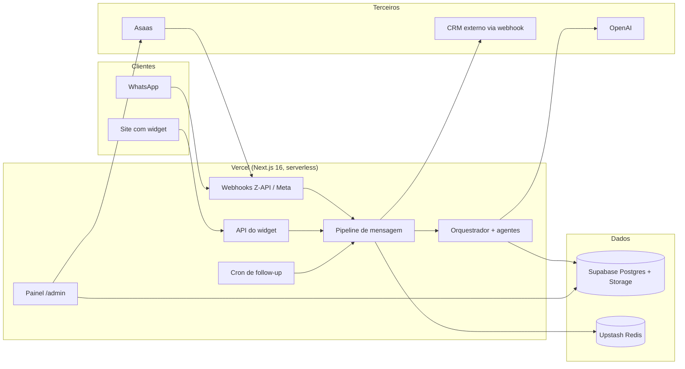
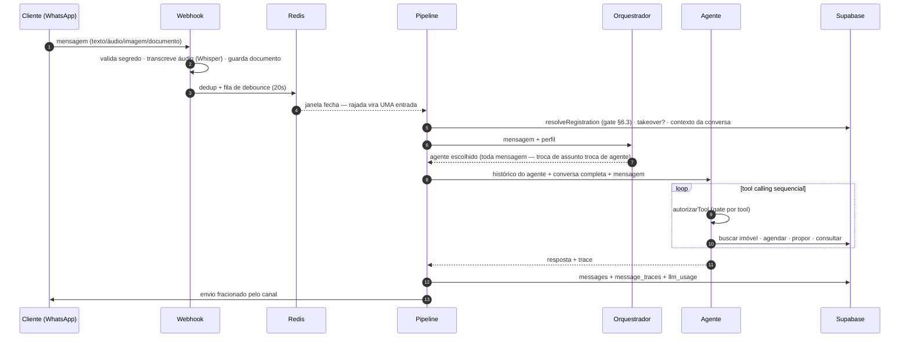
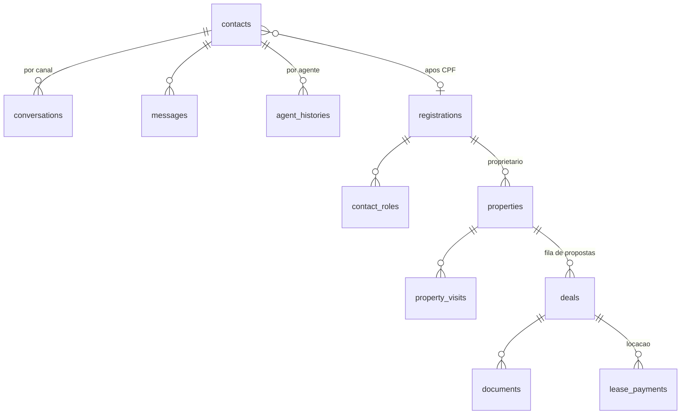

# Arquitetura da Solução — LoveHome

> Documento de arquitetura do projeto **LoveHome** (Hackathon FIAP — Agente SDR Imobiliário, Fase 5).
> Complementa o [README](../README.md) como entregável próprio: aqui está o desenho da solução,
> as decisões estruturais e suas justificativas. A modelagem de ameaças está em
> [MODELAGEM-DE-AMEACAS.md](MODELAGEM-DE-AMEACAS.md).

## 1. Visão geral

O LoveHome é uma plataforma de atendimento e gestão imobiliária: agentes de IA atendem leads por
WhatsApp e pelo site, qualificam, agendam visitas, conduzem propostas até contrato e cobrança, e um
painel web dá à equipe humana o controle de tudo — com a regra do projeto de que **ação de
consequência nunca depende de o modelo "lembrar"**: o que importa é aplicado por código.

**Stack:** Next.js 16 (App Router) + React 19 + TypeScript strict + Tailwind 4 · Supabase (Postgres
com pgvector, Storage, Auth) · Upstash Redis (dedup, debounce, limites, trancas) · OpenAI (agentes,
embeddings, Whisper, Vision) · Asaas (cobrança) · deploy na Vercel com cron.

## 2. Camadas e componentização

| Camada | Onde mora | Responsabilidade |
|---|---|---|
| Canais | `lib/channels/`, `app/api/webhook/*`, `app/api/widget/*` | Normalizar entrada (Z-API, Meta, widget) em `IncomingMessage`; enviar resposta pelo adapter do canal |
| Pipeline | `lib/pipeline/` | Dedup, identidade, gate de cadastro, takeover, roteamento, contexto da conversa, persistência |
| Agentes | `lib/agents/` | Orquestrador (roteia), 7 agentes de cliente, Copiloto interno; tool calling nativo da OpenAI |
| Domínio | `lib/negocios/`, `lib/agenda/`, `lib/leasing/`, `lib/registrations/`, `lib/imoveis/` | Regras de negócio fora das rotas HTTP, testáveis sem sessão |
| Painel | `app/admin/*`, `components/*` | ~20 telas server-first; toda página passa por `exigirAcesso`, toda rota por `autorizarApi` |
| Observabilidade | `lib/observabilidade/`, `message_traces`, `llm_usage` | Trace por resposta e custo por chamada, capturados no ponto da chamada |

Padrões que se repetem no código:

- **Regra fora da rota.** Aceitar proposta, reagendar visita, salvar condições do contrato — tudo é
  função de domínio chamada pela rota, não lógica embutida nela. É o que permite testar sem subir
  sessão e reutilizar entre agente (WhatsApp) e painel.
- **Ponto único para o que não pode divergir.** URL pública (`lib/utils/url-publica.ts`), parâmetros
  por modelo (`lib/agents/parametros.ts`), gravação de credencial (`lib/channels/salvar-config.ts`),
  registro de custo (`registrarUso`), fuso horário (`lib/agenda/fuso.ts`).
- **O modelo decide conversa; o código decide consequência.** Gate de cadastro por tool, links só de
  ferramenta (com remoção de URL inventada), confirmação de titularidade no Suporte por Redis,
  reserva de imóvel só no aceite humano.

## 3. Fluxo de uma mensagem

Decisões estruturais deste fluxo:

- **O Orquestrador roda em toda mensagem** — sem isso a primeira classificação virava permanente e o
  Suporte ficava inalcançável. Agentes não se repassam entre si; quem troca é o roteador, em código.
- **Duas memórias**: `agent_histories` por (pessoa, agente) como mensagens de chat, e a conversa
  completa (todos os atendentes, com carimbo) injetada como transcrição em todo agente — a troca de
  agente não perde o fio.
- **Debounce com líder**: só a primeira mensagem da rajada agenda o processamento; as demais entram
  na fila. Redis fora do ar degrada para processamento imediato.
- **Mídia é resolvida no webhook** (URL do Z-API expira): áudio→Whisper, imagem→Vision (e vira
  documento se houver coleta aberta), PDF→documento ou via assinada do contrato, conforme o estado
  do negócio.

## 4. Identidade e dados

Duas identidades, nunca fundidas (§6 do PRD): `contacts` (conversacional, chave `phone_key`,
recall acima de precisão) e `registrations` (formal, chave CPF, precisão total — sustenta contrato
e cobrança). CPF em três colunas com papéis distintos: `cpf_hash` (HMAC, busca), `cpf_encrypted`
(AES-256-GCM, aberto em exatamente dois lugares: contrato e Asaas) e `cpf_last4` (exibição).

40 migrations SQL versionadas em `supabase/migrations/`, aplicadas em ordem; o arquivo é o
histórico do schema. RLS deny-all para `anon` nas tabelas sensíveis (o app lê pelo `service_role`;
RLS é defesa em profundidade). Buckets privados para contratos, documentos e materiais; público só
o de fotos de imóveis.

## 5. Ciclo do negócio

Proposta → aceite humano (reserva o imóvel e abre coleta de documentos) → conferência de documentos
→ aprovação → contrato (PDF de modelo editável, placeholders validados) → via assinada (devolvida
pelo WhatsApp e confirmada por pessoa) → ativação (locação cria assinatura no Asaas; venda conclui).
Nenhum contrato nasce sem aprovação humana; desfazer devolve o imóvel à vitrine e preserva a fila.
O funil do lead acompanha: convertido na ativação, papel `inquilino_ativo` na locação.

## 6. Integrações

| Integração | Direção | Autenticação |
|---|---|---|
| Z-API (WhatsApp) | entrada/saída | segredo na URL do webhook (`?token=`), timing-safe, fail-closed |
| Meta Cloud API | entrada/saída | HMAC `X-Hub-Signature-256` do corpo bruto + verify token |
| Widget web | entrada/saída | origem registrada + token de sessão do servidor + limites em Redis |
| OpenAI | saída | chave no servidor; todo ponto pago registra em `llm_usage` |
| Asaas | saída + webhook | token no header, dedup por evento, payload cru guardado |
| CRM externo | saída (webhook de leads) | HMAC `X-Lovehome-Assinatura`; sem segredo, nada é enviado; payload sem CPF |

## 7. Escalabilidade e operação

- **Serverless stateless**: estado efêmero (dedup, debounce, trancas, limites) no Redis; estado
  durável no Postgres. Nenhuma instância guarda nada — escala horizontal da Vercel funciona.
- **Caches por processo com TTL curto** (configs de agente e canal, 5min; configurações, 60s) — a
  tela avisa a janela quando a edição afeta conversa em andamento.
- **Custos sob controle**: roteador em modelo pequeno (~USD 0,0001/mensagem), tabela de preços por
  modelo, painel de uso com entrada/saída separadas e detalhe por chamada.
- **Busca vetorial dimensionada**: ivfflat de imóveis reconstruído com `lists` proporcional ao
  volume; RAG institucional sem índice abaixo de ~2000 chunks (varredura exata é melhor).
- **Rede de regressão**: 30+ scripts `check:*` contra o banco real (documentados no README §14),
  cobrindo do gate de cadastro à ordem da fila de propostas — a maioria sem custo de OpenAI.

## 8. Decisões registradas (ADR resumido)

| Decisão | Motivo |
|---|---|
| Sem LangChain / Assistants API | Tool calling nativo + histórico próprio: menos camadas, trace completo |
| pgvector, não banco vetorial externo | Um sistema a menos; volume não justifica |
| Agenda interna, não Google Calendar | OAuth por corretor expira e quebra demonstração; tabela é auditável |
| Assinatura de contrato sem vendor | PDF + gov.br/manual devolvido pelo cliente; zero credencial de vendor |
| Autorização em código, não em RLS | Painel lê por `service_role`; matriz de papéis + recorte por carteira no servidor |
| Horário sempre em America/Sao_Paulo | Servidor em UTC errava agenda e "hoje"; ponto único `lib/agenda/fuso.ts` |
| Proposta não trava imóvel | Oferta baixa não pode esconder o imóvel de quem pagaria o anunciado |
